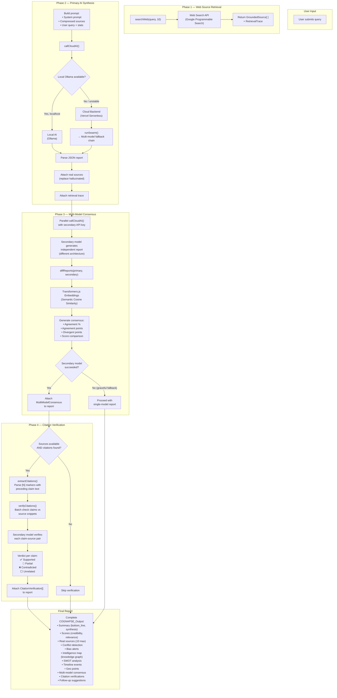
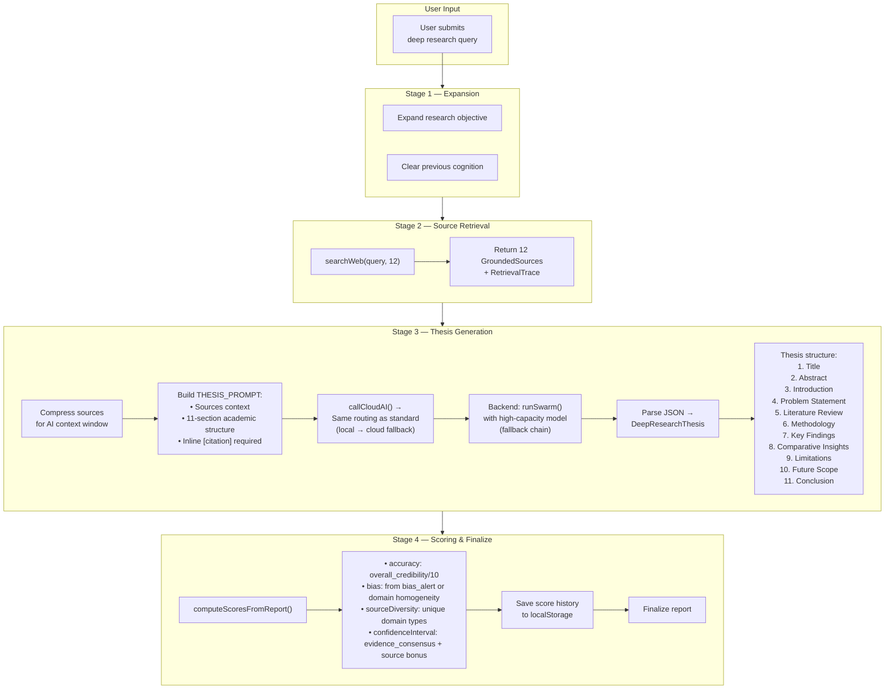
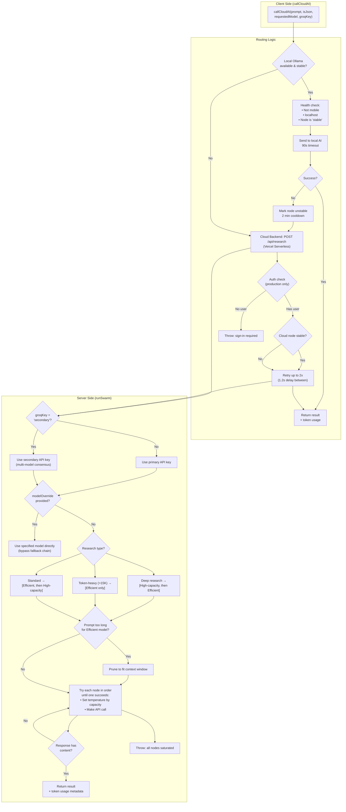
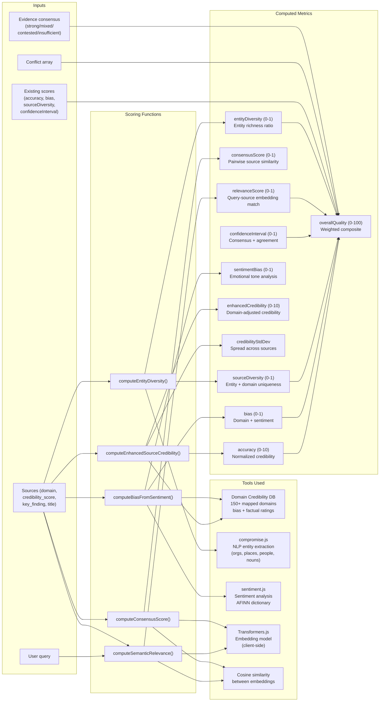
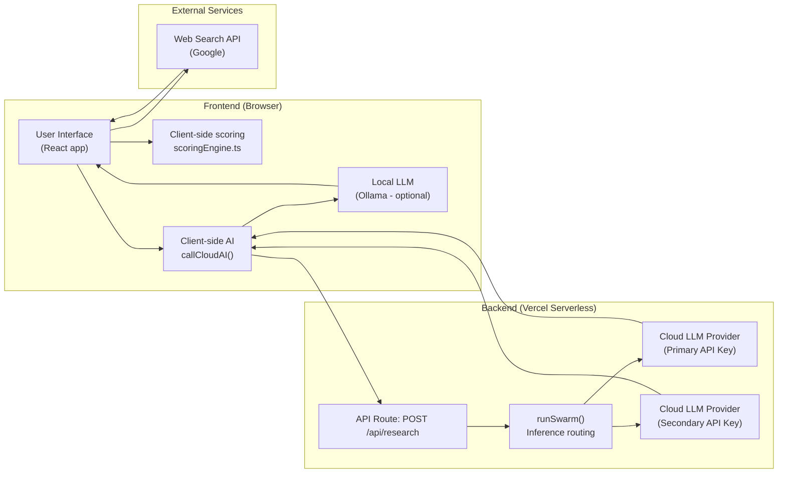

# Research Pipeline & Scoring Architecture

> **Note:** This document is a 100% accurate architectural diagram of the COGNAPSE research pipeline and scoring system. Model names have been omitted per policy. Generic descriptors are used instead.

---

## 1. Standard Research Pipeline



---

## 2. Deep Research Pipeline



---

## 3. Backend Swarm Architecture



---

## 4. Scoring Engine



---

## 5. Detailed Scoring Formulas

### overallQuality (0-100)
```
overallQuality = (
    (credibility / 10) × 0.35 +      ← Source trustworthiness
    consensusBase × 0.20 +            ← Evidence agreement level
    relevanceScore × 0.15 +           ← Query relevance
    entityDiversity × 0.10 +          ← Source variety
    (1 - bias) × 0.10 +               ← Objectivity
    confidenceInterval × 0.10         ← Overall confidence
) × 100
```

### accuracy (0-10)
```
accuracy = min(avgCredibility, 10)
```
Where `avgCredibility` is the average of per-source credibility scores, each computed as:
- **With domain info + cred score:** `factualToScore × 0.5 + cred × 0.3 + 2`
- **With domain info, no cred:** `factualToScore × 0.7 + 5 × 0.3`
- **.edu domain:** `8.5`
- **.gov / .mil domain:** `8.0`
- **Fallback:** `cred ?? 5`

### bias (0-1)
```
if (domain override exists):
  bias = domainBias × 0.7 + sentimentBias × 0.3
else:
  bias = sentimentBias
```
Where `domainBias` maps: pro-science=0.05, center=0.1, left/right-center=0.2, left/right=0.4, conspiracy=0.7, satire=0.6

### sourceDiversity (0-1)
```
sourceDiversity = entityRatio × 0.5 + domainRatio × 0.3 + topicRatio × 0.2
```
Then blended with existing score: `diversity × 0.4 + existing × 0.6`

### confidenceInterval (0-1)
```
confidenceInterval = min(
    consensusScore × 0.3 +
    consensusBase × 0.4 +
    (1 - conflictPenalty) × 0.3,
    0.99
)
```
Where `consensusBase`: strong=1, mixed=0.7, contested=0.4, insufficient=0.2
And `conflictPenalty = min(conflicts.length × 0.15, 0.45)`

### Deep Research scores (computeScoresFromReport)
```
accuracy = min(max(overall_credibility, 0), 100) / 10    (0-10)
bias = 0.2 + min(bias_alert_text_length / 200, 0.6)       (0.05-0.95)
sourceDiversity = min(unique_domain_types / 5, 1)         (0-1)
confidenceInterval = min(consensusBase + sources × 0.03, 0.99)
```

---

## 6. Data Flow Summary



---

## Score Display Map

| UI Element | Source | Scale |
|---|---|---|
| **Source Credibility** `/10` | `scores.accuracy` | 0–10 |
| **Objectivity (Low Bias)** `%` | `scores.bias` | 0–1 → display as (1-bias)% |
| **Source Diversity** `%` | `scores.sourceDiversity` | 0–1 → display as % |
| **Confidence Interval** `%` | `scores.confidenceInterval` | 0–1 → display as % |
| **Overall Quality** `%` | weighted composite | 0–100 |
| **Source Reliability Index** `/10` | `computeEnhancedSourceCredibility().average` | 0–10 |
| **Consensus Score** | multi-model agreement % | 0–100 |
| **Confidence Spread** `±%` | credibility std dev / mean | derived % |

---

*Generated from source code. Last updated: May 27, 2026.*
